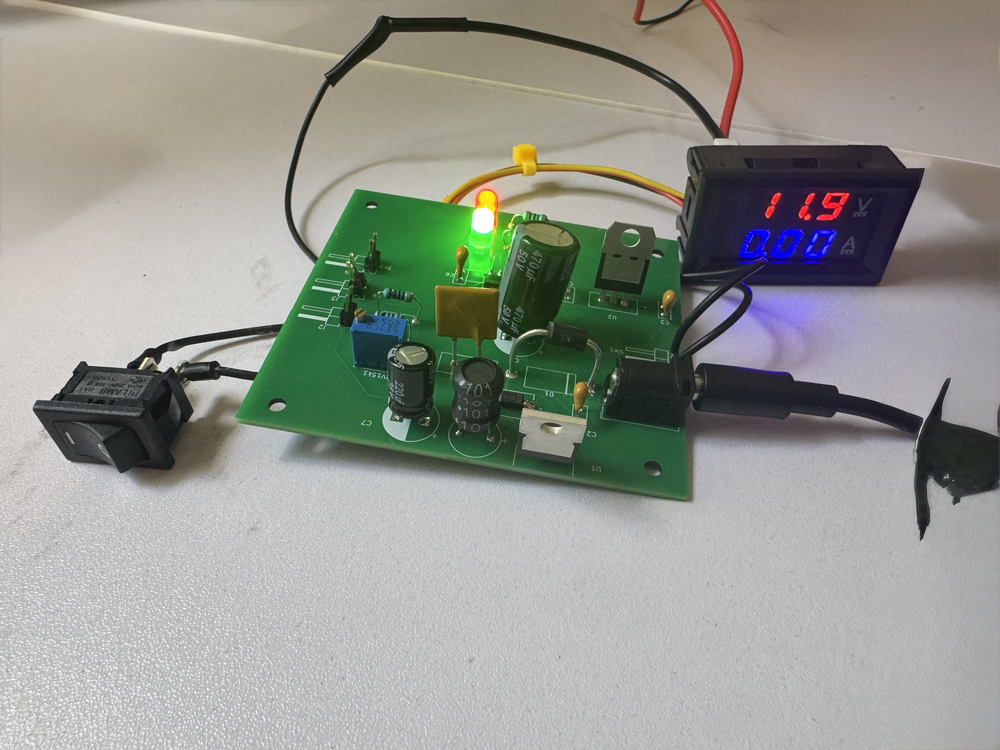
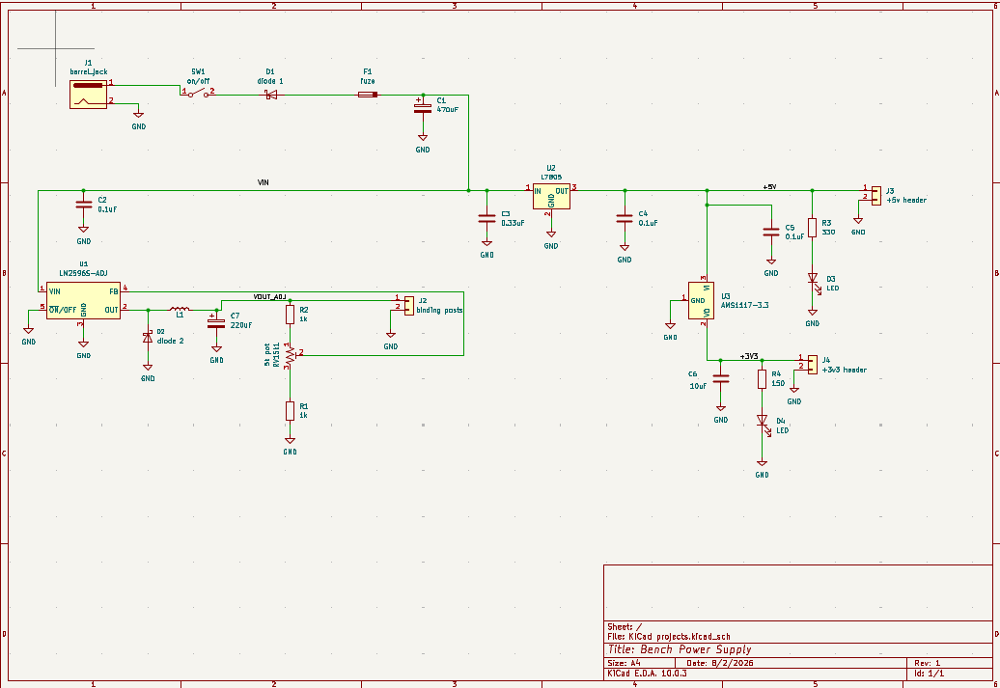
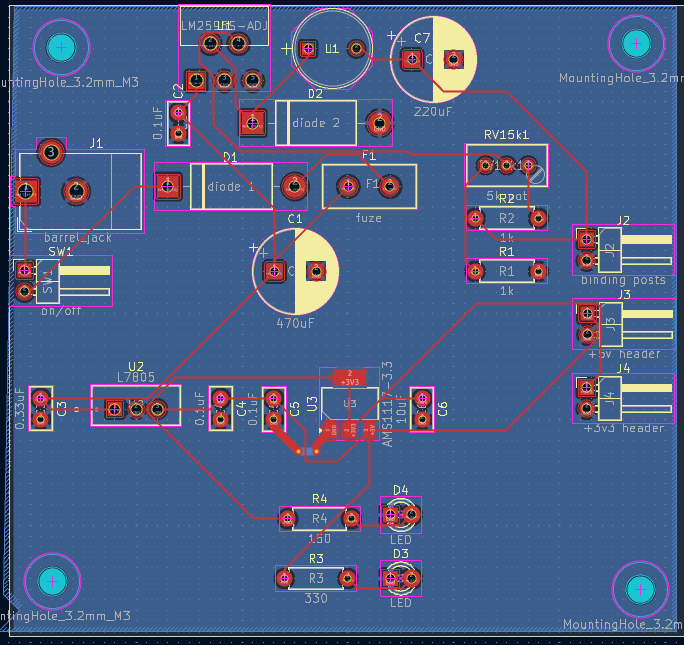
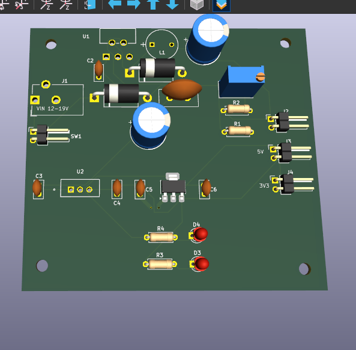

# bench-power-supply
# Adjustable Bench Power Supply

A from-scratch benchtop power supply: adjustable 1.4–11.9 V buck-regulated main output with live voltage/current display, plus fixed 5 V and 3.3 V rails. Designed in KiCad, fabricated by JLCPCB, hand-assembled, and brought up with a staged test procedure. 

## Specifications (measured)

| Parameter | Value |
|---|---|
| Input | 12 V DC barrel jack (center-positive, regulated) |
| Adjustable output | **1.4 – 11.9 V** (25-turn trimmer), ~2 A class |
| Fixed rails | 5.0 V (L7805) and 3.3 V (AMS1117) on headers |
| Metering | Panel voltmeter/ammeter on the adjustable output |
| Protection | Reverse-polarity Schottky (1N5822), 3 A resettable PTC fuse, per-rail decoupling |

## Design

- **LM2596-ADJ buck converter** for the main rail-switching regulation chosen over linear for efficiency at multi-amp loads. Output set by a feedback divider: `Vout = 1.23 × (1 + R_upper/R_lower)`, with a 25-turn trimmer as the adjustable element.
- **Fixed rails cascade from the buck's input**: the 7805 drops 12 V→5 V and the AMS1117 is fed *from the 5 V rail* rather than raw input to minimize dissipation.
- **Layout follows switching-supply practice**: the LM2596/inductor/catch-diode/capacitor loop is clustered tightly to minimize the switching current loop.

## Rev A findings — what the first board taught me

Every one of these was found by measurement during bring-up.

1. **D1 (reverse-polarity diode) was oriented backwards *in the schematic*.** The silkscreen reproduced the error, so the assembled board matched the design and this blocked all input power. Found by voltage tracing: ~12 V on the jack side of D1, ~1 V after it. Invisible to DRC and 3D review because the error was electrical, not mechanical. Fixed by desoldering and flipping the part.
2. **Maximum output was limited to 8.6 V by the feedback divider**, not by input headroom. Derived from the regulation equation: with R_lower = 1 kΩ, max Vout = 1.23 × (1 + 6k/1k) ≈ 8.6 V. Reworked R1 from 1 kΩ → 470 Ω on-board, raising the measured maximum to 11.9 V.
3. **J1 barrel jack footprint was placed rotated 180°** — the connector opening faced into the board. Resolved by flipping the 

## Bring-up lessons 

- A "12 V" wall adapter measured **25 V with no load**  it was an unregulated transformer type that only reaches nameplate under rated current. Replaced with a regulated switching adapter; my acceptance test is now a bare-plug measurement before any adapter touches a board.
- Mid-debug, **every reading came in almost exactly 2× high**  input, both fixed rails, even a USB 5 V reference. The multimeter's factory-included battery was dying, skewing its reference. Verified against known references (fresh AA cell, USB 5 V, the panel meter) before condemning any hardware. Lesson: when every measurement is wrong by the same factor, suspect the instrument first.

## Bring-up procedure

Staged and gated: visual inspection → continuity short-hunt on every rail  → adapter verification  → first power with no load, rail-by-rail measurement → potentiometer sweep across the full range → panel-meter cross-calibration against the DMM → first real load. No stage proceeds until the previous one passes.

## Rev B changes

- D1 orientation corrected in schematic
- J1 footprint rotated 180°
- R1 = 470 Ω for full output range

## Files

- `kicad/` — schematic and PCB source
- `gerbers/` — fabrication files as sent to JLCPCB
- `images/` — renders and build photos

## First real job

This supply's first load was my PID temperature controller — the panel ammeter visibly tracks the controller's PWM duty as it regulates.
